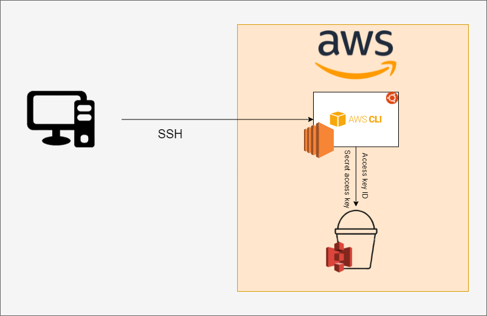

# S3 (Simple Storage Service)
### Amazon's Redundant Storage solution service.
How to connect:
- Install `python3-pip`
- Set alias `python=python3` and check `python --version`
- Install AWS CLI `sudo pip3 install awscli`
- Configure AWS CLI, `aws configure` enter keys, and region is `eu-west-1` and `json` format.
- Check and verify connection with `aws s3 ls`
  
